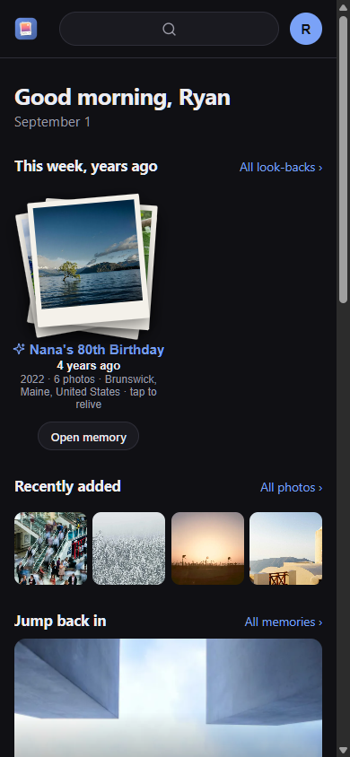
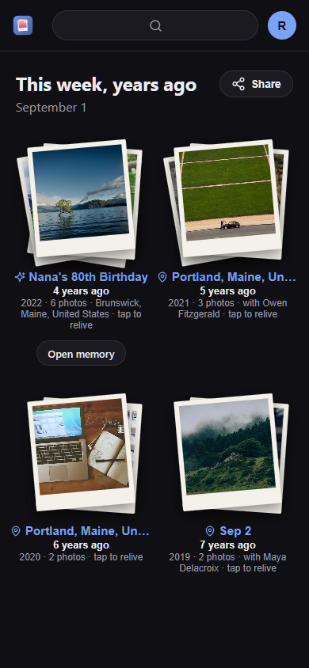
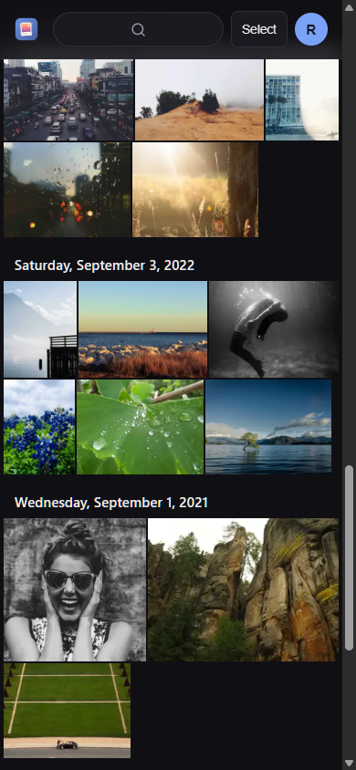
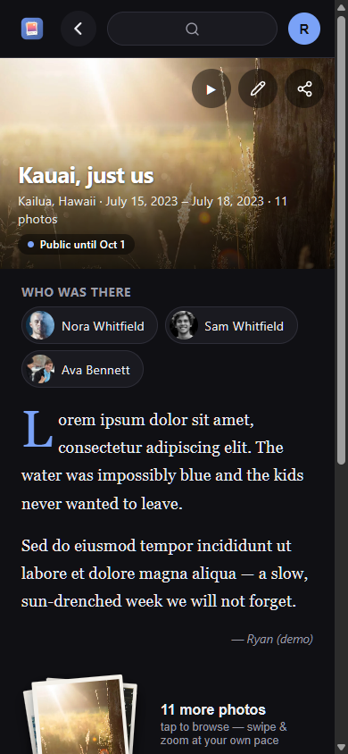
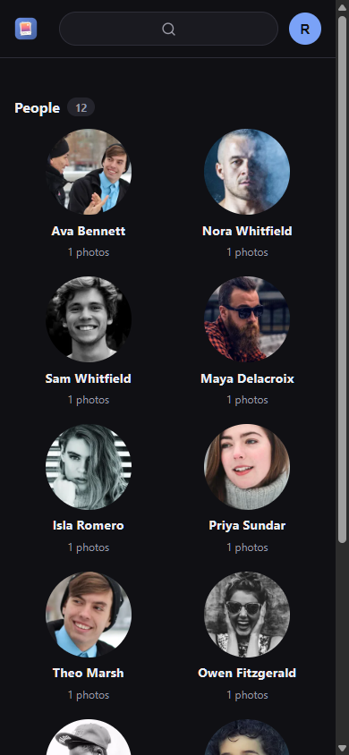
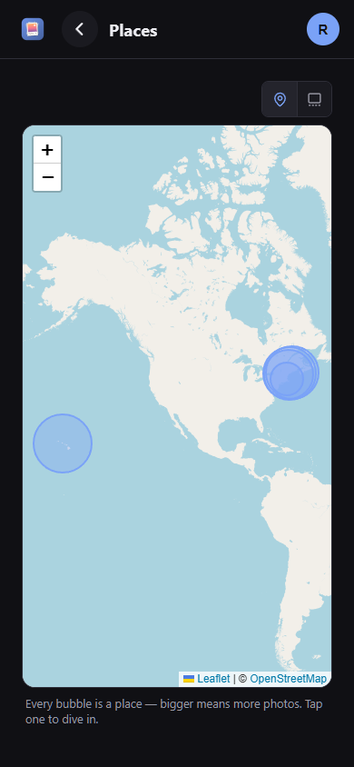
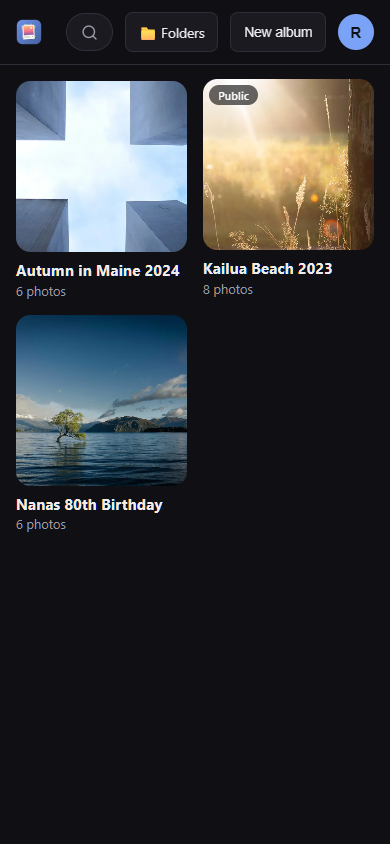
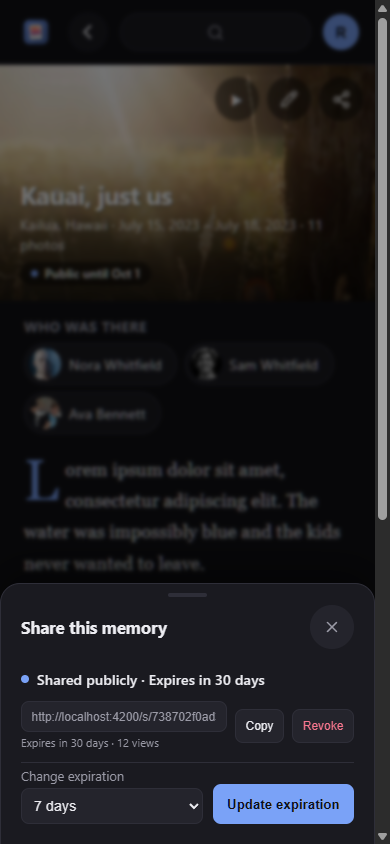
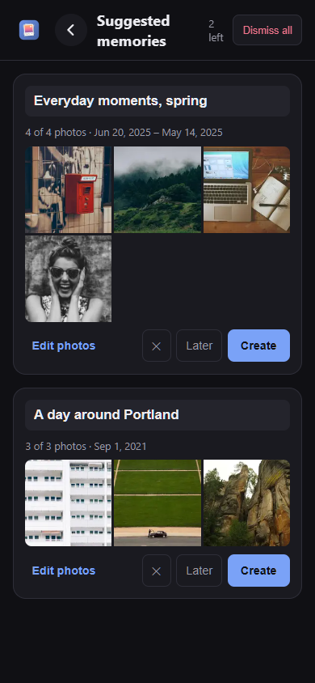

# Recollect

A mobile-first, self-hosted PWA that turns your existing photo library into an automatically
organized timeline of **Memories** — answering *"what happened?"*, not just *"what photos do I have?"*

Your NAS stays the source of truth: Recollect indexes photos **in place** (it never copies your
library), detects events, suggests Memories, recognizes the people in them, and lets your household
confirm them and add the story. It's also a genuinely good day-to-day photo app — grid, viewer,
search, places, and safe file management (delete/move with a holding period) from anywhere.

> The screenshots below are from a throwaway demo seed (license-clear stock faces and scenes,
> fictional names) — not real people.

## Screenshots

| Home | This week, years ago | Photos |
|---|---|---|
| [](docs/screenshots/01-dashboard.png) | [](docs/screenshots/03-lookback.png) | [](docs/screenshots/02-photos.png) |
| **Memory** | **People** | **Places** |
| [](docs/screenshots/04-memory.png) | [](docs/screenshots/07-people.png) | [](docs/screenshots/09-places.png) |
| **Albums** | **Sharing** | **Suggested memories** |
| [](docs/screenshots/05-albums.png) | [](docs/screenshots/06-share-drawer.png) | [](docs/screenshots/08-suggestions.png) |

## What it does

- **Memories, found for you.** Recollect clusters your photos into events by time and place and
  drops them in a **suggestions inbox** — accept one and it becomes a Memory page: a written
  **journal** (per-person, attributed), **quotes of the day**, captioned moments, a **map**, and a
  music-backed **slideshow**.
- **Who was there.** On-device **face recognition** groups faces into people you can name, merge,
  and mark as **family** (works even for a toddler with no login). Named people surface across their
  memories and rank first on the home page.
- **"This week, years ago."** A daily **look-back** of coherent moments — a place, a memory, "with
  Mom" — never a random pile of same-date photos. Optional **push notification** each morning
  (self-hosted Web Push), sent only when there's something new to relive.
- **Places.** A bubble map of everywhere your photos were taken (bigger bubble = more photos), with
  reverse-geocoded place names.
- **Albums & sharing.** Hand-pick collections, turn an album into a memory, and share a memory or
  album as a **public link** with an expiry you control (revocable any time). Guest **contribution
  links** let event guests add photos with no account.
- **A real photo app.** Justified/mosaic/large grid grouped by day, a fast full-screen viewer
  (pinch-zoom, swipe, motion-photo playback), text **and** CLIP **semantic search** ("looks like
  'beach'"), folder browsing, favorites, and correct-the-date editing that writes back to the file.
- **Phone uploads.** Pair it with [sambaloader](https://github.com/rbretschneider/sambaloader) and
  an Android camera roll backs itself up to your NAS over mutual TLS — no cloud account, and no
  integration work: Recollect just indexes the folder it lands in.
- **Cleanup advisor.** Reclaim space safely — flags junk, oversized/bloated videos (one-tap
  re-encode), probably-accidental shots (floor/blur/pocket), and **near-duplicate re-exports** —
  all tap-to-verify, nothing ever auto-deleted.
- **Safe by default.** Originals live on the NAS and are only ever modified on purpose. Delete goes
  to **Trash** with a holding period; multi-user access is cumulative grants (read ⊂ write ⊂ delete)
  plus an admin flag.
- **Backups that protect what you wrote.** Your photos are safe in your library folder, but the
  memories, journals, quotes, and names on faces exist only in the database — so Recollect backs
  them up on a schedule you set, as a `pg_dump` archive plus a plain-JSON export with no lock-in.
  See [backup & restore](docs/backup-restore.md).

## Documentation

| Doc | What's in it |
|---|---|
| [docs/backup-restore.md](docs/backup-restore.md) | Scheduled backups and the tested restore path |
| [docs/frd.md](docs/frd.md) | Functional requirements — vision, principles, architecture, stack |
| [docs/ROADMAP.md](docs/ROADMAP.md) | What's next, in order — the living short-list |
| [docs/plan.md](docs/plan.md) | Feature plan — epics & stories with acceptance criteria, phased |
| [docs/data-model.md](docs/data-model.md) | Database schema (Postgres + pgvector), lifecycle rules |
| [docs/frd-v1-original.md](docs/frd-v1-original.md) | Original draft, kept for history |

## Architecture at a glance

- **`apps/web`** — Angular PWA (the entire user experience; mobile-first, installable, auto-updating)
- **`apps/server`** — NestJS core: REST API + auth, in-place library engine, processing pipeline
  (libvips/ffmpeg/exiftool), event clustering, memories & journal, sharing, cleanup, Web Push, a
  DB-backed job queue
- **`apps/ml`** — Python/FastAPI sidecar (optional): face detection/clustering and CLIP embeddings.
  Everything degrades gracefully when it's off — faces and semantic search simply go quiet.
- **PostgreSQL + pgvector** — metadata, memories, journal, and vectors
- **Docker Compose** — deployment target (NAS / mini-PC class hardware)

## Run it (Docker)

Point Recollect at any folder of photos — it indexes in place and never copies your library.

```bash
cp .env.example .env    # set DB_PASSWORD, AUTH_TOKEN_SECRET, LIBRARY_PATH
docker compose --profile app up -d --build
```

Open http://localhost:8080, create the first (admin) account, and indexing of the mounted folder
starts automatically. New files are picked up on a schedule you choose in **Settings → Library**
(off / every few minutes / daily / weekly).

**Optional extras**

- **Face recognition + semantic search:** add the ML sidecar with `--profile ml` (a GPU helps but
  isn't required).
- **Daily look-back push notifications:** generate a VAPID keypair and set `VAPID_PUBLIC_KEY` /
  `VAPID_PRIVATE_KEY` / `VAPID_SUBJECT` in `.env`, then enable it per device in
  **Settings → Notifications**.

## Getting photos off an Android phone

Recollect indexes a folder; it doesn't upload for you. To get a phone's camera roll into that
folder automatically, pair it with **[sambaloader](https://github.com/rbretschneider/sambaloader)**
— an Android app plus a small self-hosted server that backs up new photos and videos to your NAS
over mutual TLS, with no cloud account in the middle.

The two need **no integration work**: point sambaloader's library directory at a folder Recollect
indexes, and new uploads are picked up by the normal scan. Set **Settings → Library** to
*every few minutes* and photos show up shortly after they're taken.

> Despite the name it doesn't speak SMB — the phone talks HTTPS to its own small service, which
> writes plain files into the directory your existing Samba share already serves.

## Development

Prerequisites: Node **22 LTS**, Docker, Python 3.12+ (ML sidecar only).

```bash
npm install
docker compose up -d db
npm run dev          # server (8080) + web (4200, proxied)
```

Database migrations live in `apps/server/drizzle` and are applied automatically at container boot;
generate new ones with `npx drizzle-kit generate` from `apps/server`.
