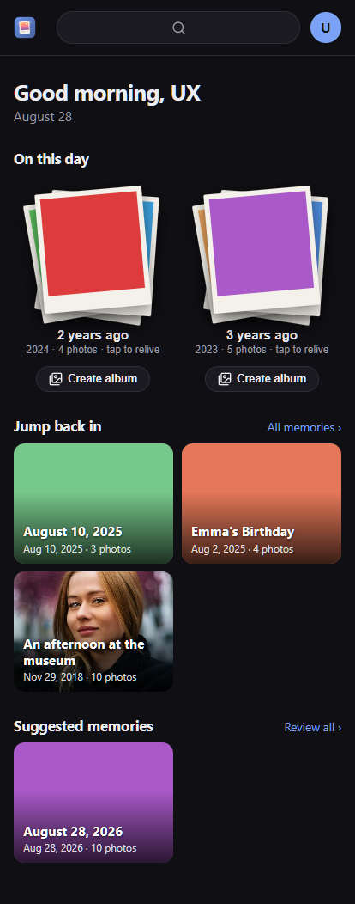
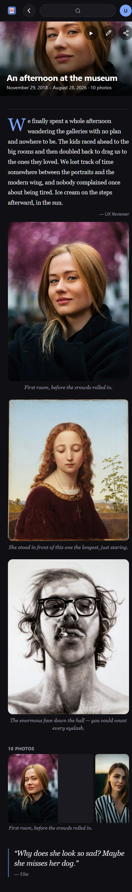
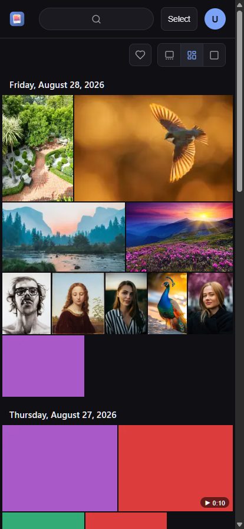
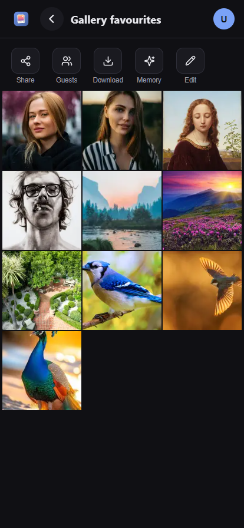
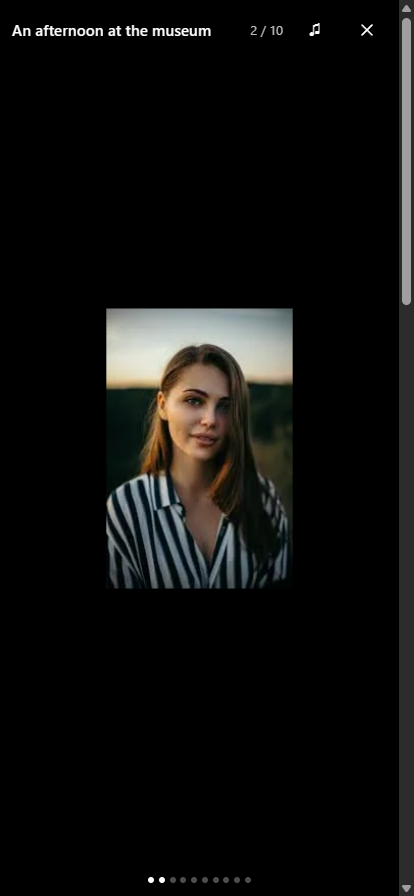

# Recollect

A mobile-first, self-hosted PWA that turns your existing photo library into an automatically
organized timeline of **Memories** — answering *"what happened?"*, not just *"what photos do I have?"*

Your NAS stays the source of truth: Recollect indexes photos **in place** (never copies your
library), detects events, suggests Memories, and lets your household confirm them and add the story.
It's also a genuinely good day-to-day photo app — grid, viewer, search, and safe file management
(delete/move with a holding period) from anywhere.

## Screenshots

| Home | Memory | Photos |
|---|---|---|
| [](docs/screenshots/dashboard.png) | [](docs/screenshots/memory.png) | [](docs/screenshots/photos.png) |
| **Album** | **Slideshow** | |
| [](docs/screenshots/album.png) | [](docs/screenshots/slideshow.png) | |

- **Home** — "On this day" through the years as fanned polaroids, with your recent and suggested memories.
- **Memory** — the scrapbook view: a journal entry, photos that step out as captioned *moments*, and quotes of the day.
- **Photos** — the whole library, grouped by day, with card / mosaic / large layouts.
- **Album** — a hand-picked set with one-tap Share, guest upload links, download, and "turn into a memory".
- **Slideshow** — tap any memory or album to play it back full-screen with public-domain background music.

## Documentation

| Doc | What's in it |
|---|---|
| [docs/frd.md](docs/frd.md) | Functional requirements — vision, principles, architecture, stack |
| [docs/ROADMAP.md](docs/ROADMAP.md) | What's next, in order — the living short-list |
| [docs/plan.md](docs/plan.md) | Feature plan — epics & stories with acceptance criteria, phased |
| [docs/data-model.md](docs/data-model.md) | Database schema (Postgres + pgvector), lifecycle rules |
| [docs/frd-v1-original.md](docs/frd-v1-original.md) | Original draft, kept for history |

## Architecture at a glance

- **`apps/web`** — Angular PWA (the entire user experience; mobile-first)
- **`apps/server`** — NestJS core: REST API + auth, in-place library engine, processing pipeline
  (libvips/ffmpeg/exiftool), event clustering, memories & journal, DB-backed job queue
- **`apps/ml`** — Python/FastAPI sidecar (Phase 2+): face detection/clustering, CLIP embeddings
- **PostgreSQL + pgvector** — metadata, memories, journal, vectors
- **Docker Compose** — deployment target (NAS / mini-PC class hardware)

## Run it (Docker)

Point Recollect at any folder of photos — it indexes in place and never copies your library.

```
cp .env.example .env    # set DB_PASSWORD, AUTH_TOKEN_SECRET, LIBRARY_PATH
docker compose --profile app up -d --build
```

Open http://localhost:8080, create the first (admin) account, and indexing of the
mounted folder starts automatically. New files are picked up by the daily rescan.

## Development

Prerequisites: Node **22 LTS**, Docker, Python 3.12+ (ML sidecar only).

```
npm install
docker compose up -d db
npm run dev          # server (8080) + web (4200, proxied)
```

Database migrations: `npx drizzle-kit generate && npx drizzle-kit migrate` from
`apps/server` (the container applies them automatically at boot).
