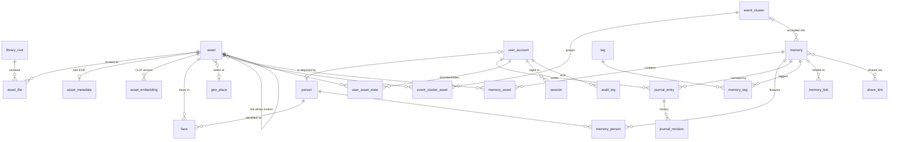

# Recollect — Data Model

> Companion to [frd.md](frd.md) and [plan.md](plan.md).
> Target: **PostgreSQL 16+ with pgvector**. (SQLite fallback noted at the end.)
> Conventions: UUIDv7 primary keys (`id`) · `timestamptz` everywhere · soft-delete via `deleted_at` where noted · enums as `text` + `CHECK` constraints (easier migrations than PG enums) · all FKs indexed.

---

## 1. The three key modeling decisions

### 1.1 Logical asset vs physical file — `asset` + `asset_file`

The identity problem (FRD §5, story S2.5): files move, get renamed, and duplicate. We split:

- **`asset`** — the *logical* photo/video, keyed by **content hash**. Everything meaningful (memories, faces, favorites, embeddings) points here. Survives any filesystem reorganization.
- **`asset_file`** — a *physical location* of that content on disk. One asset usually has one file; exact duplicates = one asset with multiple files (surfaced by the duplicates UI, S2.8). A move on disk = update one `asset_file` row; nothing else changes.

An asset with zero non-trashed files is **missing** (placeholder in UI, never breaks a memory).

### 1.2 Suggestions vs Memories — `event_cluster` ≠ `memory`

The machine writes to `event_cluster` (regenerable, versioned, disposable). Humans own `memory` (precious, never machine-mutated). Accepting a suggestion *copies* cluster membership into a memory and links provenance. Re-clustering may freely rewrite unaccepted clusters; it may only *propose* changes to memories (S7.3).

### 1.3 Person vs User, and unnamed people

- **`user`** = login account. **`person`** = someone appearing in photos. Optional link (`person.user_id`) for "this is Andrea."
- Google-Photos-style: an unnamed face cluster **is** a `person` row with `name = NULL`. Naming it is an UPDATE, merging is repointing faces + tombstone. No separate "cluster" entity to migrate between.

---

## 2. Entity-relationship overview

---

## 3. Tables

### 3.1 Identity & household

**`user_account`** *(named to avoid the `user` reserved word)*
| column | type | notes |
|---|---|---|
| id | uuid PK | |
| email | citext UNIQUE | login |
| display_name | text | |
| password_hash | text | Argon2id |
| permission | text CHECK in ('read','write','delete') | S1.4 — cumulative grant: read ⊂ write ⊂ delete |
| is_admin | bool default false | S1.5 — manage users/settings/roots; orthogonal to `permission` |
| avatar_asset_id | uuid FK→asset NULL | S1.6 |
| person_id | uuid FK→person NULL | S12.7 "this is me" |
| must_change_password | bool default false | invite flow S1.3 |
| disabled_at | timestamptz NULL | |
| created_at / updated_at | timestamptz | |

**`session`**
| column | type | notes |
|---|---|---|
| id | uuid PK | |
| user_id | uuid FK→user_account | |
| refresh_token_hash | text | rotated on use |
| device_label | text | "Andrea's iPhone" |
| created_at / last_used_at / expires_at | timestamptz | |
| revoked_at | timestamptz NULL | S1.2 revocable |

**`audit_log`** *(append-only)*
| column | type | notes |
|---|---|---|
| id | uuid PK | |
| user_id | uuid FK NULL | NULL = system |
| action | text | `asset.trash`, `file.move`, `memory.merge`, `trash.purge`, … |
| entity_type / entity_id | text / uuid | |
| detail | jsonb | before/after paths, counts |
| created_at | timestamptz | |

**`app_setting`** — `key text PK`, `value jsonb`, `updated_by`, `updated_at`. Holds everything in S11.4 (scan cron, thresholds, **holding period days — default 7**, ML toggles, worker caps).

**`client_op`** — offline-outbox idempotency (S10.3): `op_id uuid PK` (client-generated), `user_id`, `result jsonb`, `created_at`. Replayed mutations with a seen `op_id` return the stored result instead of re-executing. Pruned after 30 days.

---

### 3.2 Library & files

**`library_root`**
| column | type | notes |
|---|---|---|
| id | uuid PK | |
| path | text UNIQUE | absolute path, e.g. `/nas/Photos` |
| name | text | display label |
| include_globs / exclude_globs | text[] | S2.1; defaults exclude `@eaDir`, dotfiles, trash dir |
| watch_enabled | bool | S2.4 |
| scan_cron | text NULL | NULL = use global default |
| enabled | bool | |
| last_scan_started_at / last_scan_completed_at | timestamptz | |
| created_at | timestamptz | |

**`asset`** — the logical item; the hub of the model
| column | type | notes |
|---|---|---|
| id | uuid PK | |
| content_hash | bytea UNIQUE NOT NULL | SHA-256; the durable identity |
| phash | bigint NULL | perceptual hash, S3.5; btree index for hamming prefiltering |
| media_type | text CHECK in ('image','video') | |
| mime | text | |
| width / height | int | post-orientation |
| duration_ms | int NULL | videos |
| orientation | smallint NULL | EXIF |
| captured_at | timestamptz NOT NULL | best-known capture time |
| captured_tz_offset_min | smallint NULL | original local offset when known |
| captured_at_source | text CHECK in ('exif','filename','file_mtime','user') | S3.1; `user` is never overwritten |
| captured_day | date GENERATED (captured_at at offset) STORED | timeline grouping/scrubber |
| gps_lat / gps_lon | double precision NULL | |
| gps_alt_m | real NULL | |
| geo_place_id | uuid FK→geo_place NULL | reverse-geocode result, S13.1 |
| camera_make / camera_model / lens_model | text NULL | |
| live_motion_asset_id | uuid FK→asset NULL | on the *image* half of a Live Photo; motion asset gets `hidden_reason='live_motion'` |
| burst_key | text NULL | S7.4; equal key = same burst; index |
| hidden_reason | text NULL CHECK in ('live_motion','duplicate_resolved') | globally hidden from grids (distinct from per-user hide) |
| status | text CHECK in ('active','missing','trashed') | derived from files but denormalized for query speed |
| trashed_at / trashed_by | timestamptz / uuid FK NULL | |
| stage_metadata_at / stage_thumbs_at / stage_faces_at / stage_embed_at / stage_cluster_at | timestamptz NULL | S3.4 per-stage completion |
| stage_errors | jsonb NULL | `{ "faces": "..." }` retryable |
| created_at / updated_at | timestamptz | |

Key indexes: `(captured_at DESC, id DESC)` for the timeline; `(status) WHERE status <> 'active'` partial; `(captured_day)`; `(geo_place_id)`; `(burst_key)`.

**`asset_file`** — physical locations
| column | type | notes |
|---|---|---|
| id | uuid PK | |
| asset_id | uuid FK→asset | |
| root_id | uuid FK→library_root | |
| rel_path | text | relative to root; UNIQUE `(root_id, rel_path)` |
| file_name | text | denormalized for search |
| size_bytes | bigint | |
| fs_mtime | timestamptz | fast-path change detection (S2.3) |
| state | text CHECK in ('present','missing','trashed') | |
| trash_path | text NULL | where it went inside `.recollect-trash` (S5.1) |
| original_rel_path | text NULL | for restore (S5.2) |
| first_seen_at / last_verified_at | timestamptz | |

Asset status derivation: any `present` file → `active`; only `trashed` → `trashed`; none present/trashed → `missing`.

**`asset_metadata`** — `asset_id PK/FK`, `raw jsonb` (full exiftool dump), `extracted_at`. Kept off the hot table; queried only on the info sheet and for re-derivation.

**`user_asset_state`** — per-user overlay (S4.4/S4.5): `user_id + asset_id` composite PK, `favorite bool`, `hidden bool`, `last_viewed_at`, `updated_at`.

---

### 3.3 Jobs

**`job`**
| column | type | notes |
|---|---|---|
| id | uuid PK | |
| type | text | `scan_root`, `extract_metadata`, `gen_thumbs`, `phash`, `detect_faces`, `embed_clip`, `cluster_events`, `purge_trash`, `transcode`, … |
| payload | jsonb | typically `{assetId}` or `{rootId}` |
| dedupe_key | text UNIQUE NULL | e.g. `embed_clip:<asset_id>` prevents duplicate enqueues |
| priority | smallint | lower = sooner; user-triggered < background ML |
| status | text CHECK in ('queued','running','done','failed','cancelled') | |
| attempts / max_attempts | smallint | backoff via `run_at` |
| run_at | timestamptz | delayed/backoff scheduling |
| worker_id | text NULL | lease owner |
| lease_expires_at | timestamptz NULL | crash recovery: expired lease → back to queued |
| error | text NULL | |
| created_at / started_at / finished_at | timestamptz | |

Claim query: `SELECT … WHERE status='queued' AND run_at<=now() ORDER BY priority, run_at FOR UPDATE SKIP LOCKED LIMIT n`. Done/failed rows pruned after N days (audit_log keeps the trail).

---

### 3.4 People & faces (P2)

**`person`**
| column | type | notes |
|---|---|---|
| id | uuid PK | |
| name | text NULL | NULL = unnamed cluster (§1.3) |
| cover_face_id | uuid FK→face NULL | avatar |
| user_id | uuid FK→user_account NULL | S12.7 link |
| hidden | bool default false | "don't show this person" |
| merged_into_id | uuid FK→person NULL | tombstone after merge; reads follow the chain |
| birth_date | date NULL | 🟢 for age-at-photo |
| face_count | int | denormalized, maintained by clustering job |
| created_at / updated_at | timestamptz | |

**`face`**
| column | type | notes |
|---|---|---|
| id | uuid PK | |
| asset_id | uuid FK→asset | |
| person_id | uuid FK→person NULL | NULL = detected, not yet clustered |
| assignment | text CHECK in ('auto','user') | user assignments never moved by re-clustering |
| bbox | real[4] | x,y,w,h normalized 0–1 |
| quality | real | detector confidence/size score |
| ignored | bool default false | S12.4 "ignore this face" |
| embedding | vector(512) | model per `embed_model` |
| embed_model | text | e.g. `arcface-r50-v1` |
| created_at | timestamptz | |

Indexes: `(person_id)`, `(asset_id)`, HNSW on `embedding` (cosine) for clustering/similar-face lookups.

---

### 3.5 Places (P2)

**`geo_place`** — canonical places from the bundled offline gazetteer + user-created pins:
`id`, `name`, `admin1` (state/region), `country_code`, `lat`, `lon`, `kind` CHECK in ('city','poi','user_pin'), `created_by NULL`. Assets and memories FK here; search FTS covers `name`/`admin1`/country.

**`geocode_cache`** — `lat_r/lon_r` (rounded ~1km, composite PK) → `geo_place_id`, so reverse geocoding each asset is a lookup, not a computation.

---

### 3.6 Event detection (suggestions)

**`event_cluster`**
| column | type | notes |
|---|---|---|
| id | uuid PK | |
| algo_version | int | S7.1 — bump invalidates/regenerates unaccepted clusters |
| status | text CHECK in ('suggested','accepted','dismissed','expired','superseded') | |
| start_at / end_at | timestamptz | span of member assets |
| geo_place_id | uuid FK NULL | dominant place |
| seed_title | text | "Jul 18–21 · Bar Harbor" (S7.2) |
| score | real | confidence, drives inbox ordering + S8.6 expiry |
| signals | jsonb | explainability: gaps, distances, people overlap (T2+) |
| accepted_memory_id | uuid FK→memory NULL | provenance |
| dismissed_signature | bytea NULL | hash of member set at dismissal — identical re-detection stays dismissed (S8.5) |
| created_at / updated_at | timestamptz | |

**`event_cluster_asset`** — `cluster_id + asset_id` composite PK. Assets may appear in multiple clusters over time but in ≤1 `suggested` cluster (enforced by clustering job, not constraint).

**`memory_addition_suggestion`** *(S7.3 — proposals to confirmed memories)*: `id`, `memory_id FK`, `status` ('pending','accepted','rejected'), `created_at`; child table `memory_addition_asset (suggestion_id, asset_id)`.

---

### 3.7 Memories & journal (the crown jewels)

**`memory`**
| column | type | notes |
|---|---|---|
| id | uuid PK | |
| title | text NOT NULL | |
| description | text NULL | short subtitle; distinct from journal |
| start_at / end_at | timestamptz | |
| date_precision | text CHECK in ('exact','day','month','year','approx') | S9.3 |
| cover_asset_id | uuid FK→asset NULL | NULL → first asset |
| geo_place_id | uuid FK NULL | |
| location_label | text NULL | freeform override ("The lake house") |
| visibility | text CHECK in ('household','private') | S14.1 |
| owner_user_id | uuid FK | creator; governs private visibility |
| parent_memory_id | uuid FK→memory NULL | S16.3 trips contain day-memories |
| kind | text CHECK in ('event','trip') default 'event' | |
| source_cluster_id | uuid FK→event_cluster NULL | provenance |
| custom_fields | jsonb NULL | FRD "custom metadata" |
| search_tsv | tsvector GENERATED (title, description, location_label) | FTS |
| created_by / created_at / updated_at | timestamptz | |
| deleted_at / deleted_by | timestamptz / uuid NULL | soft-delete with retention (S9.7) |

**`memory_asset`** — `memory_id + asset_id` PK, `sort_order int`, `added_by`, `added_at`. An asset may belong to many memories. Trashed/missing assets stay in the table (tombstone rendering, S5.1/S2.6).

**`memory_person`** — `memory_id + person_id` PK, `source` CHECK in ('auto','user'), `added_at`. Auto rows maintained by face pipeline; user rows never auto-removed.

**`journal_entry`**
| column | type | notes |
|---|---|---|
| id | uuid PK | |
| memory_id | uuid FK | |
| author_user_id | uuid FK | attribution (S9.6) |
| body_md | text | markdown-lite |
| search_tsv | tsvector GENERATED | |
| created_at / updated_at | timestamptz | |
| deleted_at | timestamptz NULL | |

**`journal_revision`** — `id`, `entry_id FK`, `body_md`, `saved_at`, `saved_by`, `reason` CHECK in ('edit','conflict','merge'). Conflict copies from offline sync (S10.3) land here with `reason='conflict'` and are surfaced in UI.

**`tag`** (`id`, `name citext UNIQUE`) + **`memory_tag`** (`memory_id + tag_id` PK).

**`memory_link`** — `memory_id + related_memory_id` PK (stored with `memory_id < related_memory_id` to dedupe), `created_by`.

---

### 3.8 Semantic search (P3)

**`asset_embedding`** — `asset_id + model` composite PK, `embedding vector(512)`, `created_at`. Separate table (not a column on `asset`) so model upgrades can run side-by-side and old vectors drop cleanly. HNSW (cosine) index per model via partial index.

---

### 3.9 Sharing (P2)

**`share_link`** — `id`, `memory_id FK`, `token text UNIQUE` (high entropy), `created_by`, `include_journal bool`, `password_hash NULL`, `expires_at NULL`, `revoked_at NULL`, `view_count`, `created_at`.

---

## 4. Queries the model must make fast (design checks)

| Query | Served by |
|---|---|
| Timeline page: N assets before cursor `(captured_at, id)`, active only, minus my hidden | `asset(captured_at DESC, id DESC)` + anti-join `user_asset_state.hidden` |
| Scrubber counts per month | `SELECT date_trunc('month', captured_day), count(*)` — matview or cached, refreshed on ingest |
| Memory timeline by year | `memory(start_at DESC)` partial index `WHERE deleted_at IS NULL` |
| "Memories with Grandma" | `memory_person(person_id)` → memories |
| Rescan fast-path | `asset_file(root_id, rel_path)` unique lookup vs (size, mtime) |
| Re-link moved file | `asset(content_hash)` unique lookup |
| Inbox | `event_cluster(status='suggested') ORDER BY score DESC` partial index |
| Text search | FTS over `memory.search_tsv`, `journal_entry.search_tsv`, `person.name`, `tag.name`, `geo_place.name`, `asset_file.file_name` — one UNION'd search endpoint |
| Semantic search | pgvector HNSW on `asset_embedding` blended with FTS ranks |
| Similar faces | HNSW on `face.embedding` |
| Purge due trash | `asset(trashed_at) WHERE status='trashed' AND trashed_at < now()-retention` |

---

## 5. Integrity & lifecycle rules (enforced in service layer)

1. **Journal is sacred:** `journal_entry`/`journal_revision` rows are never deleted by any automated process; memory soft-delete retains them for the retention window; export (S11.5) includes all revisions.
2. **Machine writes** are confined to: `event_cluster*`, `face` (auto assignments), `memory_person(source='auto')`, `asset` stage fields, seed metadata. Machine code never updates `memory` content fields or user-sourced rows.
3. **`captured_at_source='user'`** wins over any re-extraction, forever.
4. **Trash flow:** trash = `asset_file.state='trashed'` + physical move + `asset.status` recompute; restore reverses it; purge deletes files + `asset_file` rows, keeps `asset` row as tombstone if any memory references it, else hard-deletes.
5. **Person merge:** repoint `face.person_id`, `memory_person`, set `merged_into_id`; never merge two user-named persons automatically.
6. **Deletes cascade nothing across the human/machine boundary** — removing an asset from a memory doesn't touch files; trashing a file doesn't remove memory membership (tombstone).
7. **Grant enforcement:** mutations to shared state require `write`; any file operation (trash/move/rename/purge/restore) requires `delete`; `user_asset_state` (favorites/hidden) is exempt — it's viewer-private and allowed at `read`. `is_admin` gates user/settings/root management and early purge, but does not bypass the `delete` grant for media.

---

## 6. SQLite fallback mapping (if Postgres is rejected)

- `vector` → sqlite-vec virtual tables (`face_vec`, `asset_vec`) keyed by rowid ↔ id map.
- `tsvector` → FTS5 external-content tables.
- `citext` → `COLLATE NOCASE`; `uuid` → text; arrays/jsonb → JSON text.
- Job claiming: `SKIP LOCKED` unavailable → single-writer queue worker with WAL mode.
- Everything else ports 1:1. The service layer should stay SQL-portable in shape even though Postgres is the recommendation.

---

## 7. Open modeling questions

1. **RAW+JPEG pairs** — treat like Live Photos (one logical asset, JPEG primary, RAW linked) or separate assets? *Lean: pair, JPEG primary.*
2. **Albums** — do we ever need classic albums, or do manual Memories (S9.5) cover it? *Lean: memories cover it; revisit if Wife asks for albums.*
3. **Per-user private favorites already exist — do we need private *assets*** (hide from household)? *Lean: no for MVP; visibility is per-memory only.*
4. **Video face detection** — keyframes only, sampled at what rate? *Defer to P2 tuning.*
5. **Multi-household/tenancy** — out of scope; single household per deployment. Revisit only if the project goes public.
