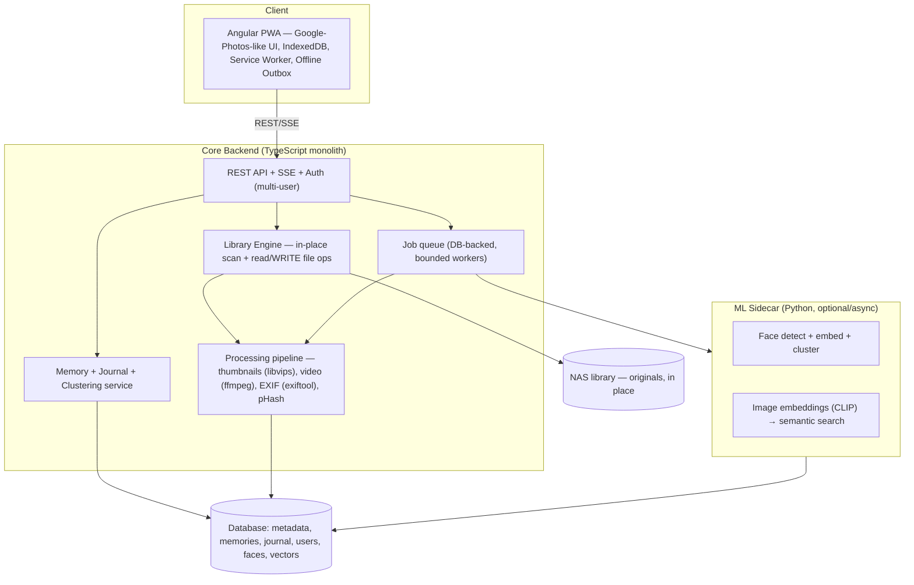

# Recollect — Functional Requirements (v2)

> **Recollect** — a mobile-first PWA that turns your existing photo library into a timeline of Memories.
> **Status:** Working refinement of the original ChatGPT draft (preserved as `frd-v1-original.md`).
> **Architecture:** We build our **own app** that indexes an existing photo library **in place** (no copying) with **full read/write** management, adds a **Memory/Journal** layer on top, and runs its own **ML** for faces and semantic search. Existing tools (PhotoPrism/Immich) are, at most, optional *read-only import sources* later — not the core.
> **Non-negotiables:** PWA · multi-user · in-place + writable · "would my wife use this?" · ML happens.

---

## 0. The North-Star heuristic — "Wife Approval"

Every product decision is judged by one question:

> **Would a non-technical person who already uses Google Photos use this without being taught?**

Concretely that means:

- **Zero learning curve.** If she can use Google Photos/Immich, she can use this. No new mental model.
- **No jargon in the UI.** Never "cluster," "embedding," "ingest," "index." Only **Photos, Memories, People, Places, Search**.
- **Nothing destructive without obvious undo.** Delete → Trash → Restore. Never a scary irreversible button.
- **Fast and quiet.** Instant thumbnails, no spinners-of-doom, no config screens in the daily path.
- **Familiar shapes.** Steal the *best* interaction patterns from Google Photos, Immich, and PhotoPrism (see §11) — don't invent novel UX.

If a feature can't pass Wife Approval, it's an admin/settings feature, hidden from the daily experience.

---

## 1. Product vision

A **mobile-first, privacy-first PWA** that turns an existing photo/video library into an automatically organized timeline of **Memories**, while also being a genuinely good day-to-day photo app.

Two jobs, one product:

1. **Photo app** (the familiar part): browse, search, view, share, and **manage** (delete/move) your library — in place, on your NAS, from anywhere. This is the Google-Photos-parity layer that earns Wife Approval.
2. **Memory layer** (the differentiator): the system notices *"something happened,"* proposes **Memories**, and lets anyone confirm them and add a sentence of story. Answers **"What happened?"**, not just **"What photos do I have?"**

The Memory/Event is the primary *differentiating* object; the photo grid is the primary *familiar* object. Both must be excellent.

---

## 2. Core principles

- **NAS is the source of truth.** Files live where they already live. We index in place and **never copy the library**. We own only `app data` (DB, thumbnails, caches, embeddings).
- **In-place *and* writable.** Unlike Immich external libraries (read-only), we support real management: delete, move, organize the original files from the app, from anywhere — with Trash + Restore as the safety net.
- **Multi-user from day one.** A household shares one library; each person has their own login; journal entries are attributed; destructive actions are guarded and logged.
- **Automatic first, human-curated.** ML organizes; people decide. AI suggests, never silently overwrites authored content.
- **Lightweight core, heavy work optional.** Runs on a NAS/mini-PC. ML is real and in-scope but **async, resumable, throttled, cancellable** — a night of new photos never makes the app unusable.
- **Offline-tolerant.** Browse cached memories, read/write journal entries offline; sync on reconnect.

---

## 3. System architecture



**Single lightweight monolith** for the core (API + library engine + pipeline + memory/clustering + jobs). **One optional sidecar** for ML. No Kubernetes/Kafka/RabbitMQ/Redis required. GPU optional (speeds ML; not required).

---

## 4. Technology stack

| Layer | Choice | Notes |
|---|---|---|
| **UI** | **Angular 21+ PWA** | Mandatory. Standalone components, signals, zoneless where sensible, CDK + selective Material, custom lightweight photo components. |
| Client storage | IndexedDB + Dexie | Offline cache, drafts, mutation outbox. |
| **Core backend** | **TypeScript (NestJS)** | Shares DTOs with Angular; structured DI like ASP.NET. Fastify if leaner is wanted. |
| Library engine | Node fs + `chokidar` watch | In-place scan + **read/write** file ops (delete→trash, move/rename). |
| Thumbnails/images | **libvips** via `sharp` | Resize, thumbs, HEIC, orientation. |
| Video | **ffmpeg** (`fluent-ffmpeg`) | Video thumbs, previews, Live Photo pairing, transcode when needed. |
| Metadata | **exiftool** (`exiftool-vendored`) | EXIF, GPS, dates, camera. |
| Dedup/bursts | pHash/blockhash lib | Near-dupes, bursts, similar grouping. |
| Jobs | **DB-backed queue + bounded workers** | No Redis. Resumable, throttled, cancellable. |
| Realtime | **SSE** | Processing/status → UI. |
| **ML sidecar** | **Python + FastAPI**, ONNX Runtime | Faces (detect/embed/cluster, e.g. InsightFace/SCRFD) + CLIP embeddings. CPU-first, optional GPU. |
| **Database** | **PostgreSQL + pgvector** *(recommended)* — SQLite+sqlite-vec fallback | See §4.1. |
| Search | Postgres FTS (or SQLite FTS5) + pgvector | Text + metadata + semantic in one store. |
| Auth | Local accounts (email+password, Argon2) → OIDC later | Multi-user, roles. See §7. |
| Deploy | **Docker Compose** | core + ml + db containers; mount the NAS library. |

### 4.1 Database: why Postgres+pgvector over SQLite

v1 said SQLite for "no extra infra." But we now have **multi-user concurrent writes + face/image vectors + 20k+ assets**. That's exactly the workload Immich runs on **Postgres + pgvector**, and for good reason: real concurrency, mature vector indexing (HNSW), reliability.

- **Recommended: Postgres + pgvector.** One extra container in Compose — trivial on a NAS. Best fit for multi-user + ML + growth.
- **Fallback: SQLite + sqlite-vec.** Genuinely fine for a single small household and simplest to ship; WAL handles light concurrency. Risk: vector search and concurrent writes get strained as the library and user count grow.

> Recommendation: **Postgres+pgvector**. The "no infra" savings of SQLite don't survive the multi-user + ML requirements you just set.

---

## 5. Library Engine (in-place + writable — the thing no provider gives you)

The Library Engine is what makes this app worth building. It does what Immich-external refuses to and PhotoPrism does awkwardly:

- **Scan in place.** Point at NAS folders; index files where they are. Never copy originals.
- **Incremental + scheduled + watched.** `chokidar` watch where the mount supports it; scheduled rescan (nightly) as the reliable fallback for network shares; **no full rescans** beyond an explicit user reconcile.
- **Writable operations, safely:**
  - **Delete** → move original to an app-managed **Trash** folder (or DB-tracked soft-delete), purge on retention timer. Real deletion is possible but always via Trash first. ("Oops, ground pics" → swipe delete → gone from the grid, restorable for N days.)
  - **Move/rename/organize** originals on disk from the app.
  - All destructive ops: confirmed, undoable, attributed to a user, logged.
- **Stable identity** via content hash so moves/renames on disk don't orphan Memories, faces, or journal links.
- **Multi-tool-safe.** Assumes other tools may share the folder; hash-based reconciliation absorbs external changes.

---

## 6. Processing pipeline

```
Discover (scan/watch) → Metadata (exiftool) → Thumbnails (libvips) →
[async] Faces (ML) → [async] Embeddings (ML) → Clustering → Memory Suggestions
```

Each asset has explicit processing **state** (discovered → metadata → thumbnailed → faces → embedded → clustered). **Failures are recoverable and isolated:** a failed ML step never blocks a photo from appearing or being browsed. Heavy steps are bounded so overnight bulk imports don't melt the NAS.

---

## 7. Multi-user & sharing (new — first-class)

- **Accounts.** Each household member has a login (email + password, Argon2 hashing; OIDC/SSO later). Short-lived access token in memory + refresh via httpOnly cookie; no secrets in localStorage.
- **Permission model = grants, not roles.** Each user is added with a permission level; each level includes the ones below it:
  - **Read** — browse, search, view. No changes to anything (not even favorites-visible-to-others; per-user favorites/hidden are allowed since they affect only the viewer).
  - **Write** — Read + create/edit memories, journal entries, tags, people naming, albums "and shit." No file operations.
  - **Delete** — Write + remove media permanently: trash, move, purge. All deletes go through a **holding period** (default 7 days, configurable) before physical purge; restorable until then.
  - **Admin flag** (orthogonal to grants): manage users, settings, library roots, view audit log. The first account is admin+delete.
- **Attribution:** journal entries and edits are stamped with the author ("Andrea wrote…").
- **Memory visibility (phase 2+):** shared vs private memories; personal favorites per user.
- **Guardrails:** destructive actions are grant-gated server-side, undoable during the holding period, and audit-logged.
- **People ≠ Users.** A **Person** is someone appearing in photos (a face identity); a **User** is an account. They're separate models (a person may have no account; a user may not appear in any photo).

---

## 8. Automatic event detection (Memories)

Escalating signals, deterministic-first so it's useful before ML finishes:

| Tier | Signals | Source |
|---|---|---|
| 1 — Metadata | timestamp, GPS, distance, time-gaps, media type, device, import batch | Our EXIF pipeline |
| 2 — Relationships | overlapping people, bursts, photo/video pairs, near-dupes, similar places | pHash + faces |
| 3 — Vision | scene/embedding similarity, face grouping | **Our ML sidecar** |
| 4 — Interpretation (optional) | titles/summaries ("family trip to Boston") | Optional local/cloud LLM |

Tier 1 produces baseline Memories immediately; higher tiers refine them as ML catches up. **AI suggests; the user decides.**

---

## 9. Memory Inbox & editing

- **Inbox:** newly detected clusters appear as **Suggested Memories** (e.g. "Boston Aquarium · 83 photos · 4 videos · Jul 21 · Ryan, Andrea"). Actions: **Create · Merge · Split · Ignore.** Goal: reduce organizing thousands of photos to approving a handful of cards.
- **Memory fields:** title, description, journal entry, start/end/approx date, location, people, cover, media (photos/videos/Live Photos), tags, related memories, custom metadata.
- **Operations:** create, edit, delete, merge, split, add/remove/reorder media, change cover/date/location, add/remove people, tag, link related. **Users can fully override any AI decision.**

---

## 10. People (ML-backed)

Face detection → clustering → **Face → Person** (not "every face is a user"). Support: detection, clustering, face embeddings, known people, unknown clusters, naming, identity merge, ignore-face, event/person relationships. UI mirrors Google Photos' **People** row (circular avatars, tap to name/merge). ML is committed here — this is a core expectation, not optional long-term.

---

## 11. UX — steal the best (Wife Approval in practice)

Take the strongest patterns from each; don't invent:

| From | Steal |
|---|---|
| **Google Photos** | Justified/mosaic scrolling grid; pinch-to-change density; instant top-of-screen search; **Memories** resurfacing carousel; People avatars; frictionless fullscreen swipe; minimal chrome. |
| **Immich** | Fast timeline **scrubber** (jump by year/month); map view; albums; partner/multi-user sharing; memory lane; polished installable mobile PWA. |
| **PhotoPrism** | Strong search/labels; Places map; album/story presentation. |

Core navigation (bottom nav, thumb-reachable): **Photos · Memories · Search · (Library/People/Places)**. Mobile-first; desktop is an enhanced layout of the *same* app. Required: swipeable galleries, touch gestures, fullscreen media, responsive cards, optimistic UI, skeletons, **virtualized lists**, installability, offline.

---

## 12. Search

One search box, combining: full text, metadata, dates, locations, people, tags, and **semantic similarity** (CLIP). Must handle: "Maine", "Ryan and Andrea", "camping", "beach", "Boston in 2025", "that trip last summer". Long-term: a searchable personal knowledge graph, not filename search.

---

## 13. Non-functional requirements

- **Auth/security:** roles, Argon2, httpOnly refresh, all file ops server-side, secrets never in the client.
- **Backup/restore/export:** the DB (journal = irreplaceable) gets one-command backup + auto-backup; **export** memories+journal to JSON/Markdown referencing originals by hash/path. No lock-in.
- **Observability:** structured logs, `/health`, visible processing panel (indexed/faces/failed counts).
- **API:** versioned REST (`/api/v1`) + OpenAPI → generated Angular client.
- **Config:** library paths, scan interval, clustering thresholds, trash retention, ML on/off + model, cache size — all without code changes.
- **Deletion semantics:** everything destructive goes through Trash + retention; role-gated; undoable; audit-logged.
- **Performance:** lazy loading, thumbnail-first, virtual scroll, bounded workers, incremental indexing, no full rescans, aggressive caching, proper indexes, async/resumable jobs, graceful degradation when ML is down.

---

## 14. Development phases

**Phase 1 — "A photo app that earns trust"**
Angular PWA · TS backend · Postgres · multi-user auth (owner/member) · **in-place library scan + writable delete(→trash)/move** · EXIF · thumbnails · Google-Photos-like grid + fullscreen + timeline scrubber · basic search (text/metadata/date) · Tier-1 Memory suggestions · Inbox (create/merge/split/ignore) · Memory edit + journal entry · offline browse + journal.
*Bar: passes Wife Approval as a daily photo app.*

**Phase 2 — "Remember it"**
ML sidecar: **faces** (detect/cluster/name/merge) · People UI · people-on-memories · Places/map · richer memory timeline · shared vs private memories.

**Phase 3 — "Understand it"**
CLIP **semantic search** · smarter Tier-2/3 clustering · optional LLM titles/summaries · related memories · On-This-Day/memory resurfacing.

**Phase 4 — "Your life"**
Annual summaries · trips · person/place timelines · automatic yearbooks · long-term life timeline · optional read-only import from PhotoPrism/Immich for existing metadata.

---

## 15. MVP definition

Success = a household can: sign in (multiple users), point the app at existing NAS folders, browse the whole library **fast** in a familiar grid, **delete/move** photos in place (safely, via trash), search by metadata/date, get automatic Tier-1 Memory suggestions, confirm one into a Memory, edit its title/date/location and media, write a journal entry, browse the Memory timeline, and keep ingesting new photos automatically — mobile-first, installable, offline-tolerant, **and the non-technical spouse uses it without a tutorial.**

Critical loop: **New photos → auto event detection → confirm → Memory → optional journal entry.**

---

## 16. North Star

> "Show me our life in 2025" returns a year of **Memories** — with media, people, places, dates, and what the family actually remembers — not 8,000 photos. The computer does the tedious part (finding, grouping, identifying, organizing); the human does the irreplaceable part ("this is what that day meant to us").

---

## 17. Open decisions

1. **DB:** confirm Postgres+pgvector (recommended) vs SQLite+sqlite-vec.
2. **Backend language:** confirm TypeScript/NestJS core (with Python ML sidecar) — or reconsider Go/.NET for the core.
3. **Shared-library model:** one shared household library for MVP (recommended) — do we need per-user private libraries too, or just private *memories* later?
4. **Delete = real delete?** Confirm Trash-with-retention model and default retention window.
5. **Face model choice** for the ML sidecar (InsightFace/SCRFD vs alternatives) and CPU-only baseline targets.
6. **Import from existing tools:** is read-only import of PhotoPrism/Immich metadata worth a Phase-4 adapter, or fully skip?
```
